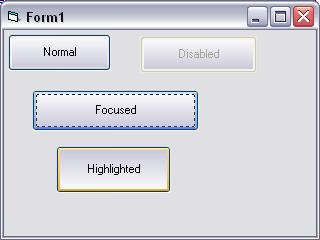



## XP Button \(Remade v1\.2\)

### Description

This XP button is a remake of my older version. This one includes the xp silver gradient colour, highlight effects, disable effects, hover effects, focus effects and acts the same way as a normal button. If you click the button but didn't mean to, you just drag your mouse off the button the same way you do for a normal command button. See screenshot for details
 
### More Info
 

             |
---                |---
**Submitted On**   |2003-09-08 23:37:30
**By**             |[Michael Manning](https://github.com/Planet-Source-Code/PSCIndex/blob/master/ByAuthor/michael-manning.md)
**Level**          |Advanced
**User Rating**    |5.0 (10 globes from 2 users)
**Compatibility**  |VB 6\.0
**Category**       |[Graphics](https://github.com/Planet-Source-Code/PSCIndex/blob/master/ByCategory/graphics__1-46.md)
**World**          |[Visual Basic](https://github.com/Planet-Source-Code/PSCIndex/blob/master/ByWorld/visual-basic.md)
**Archive File**   |[XP\_Button\_1645139142003\.zip](https://github.com/Planet-Source-Code/michael-manning-xp-button-remade-v1-2__1-48351/archive/master.zip)

